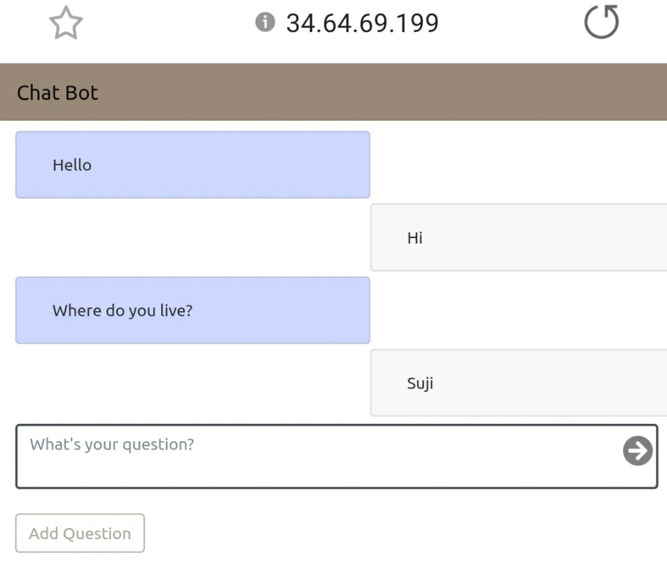
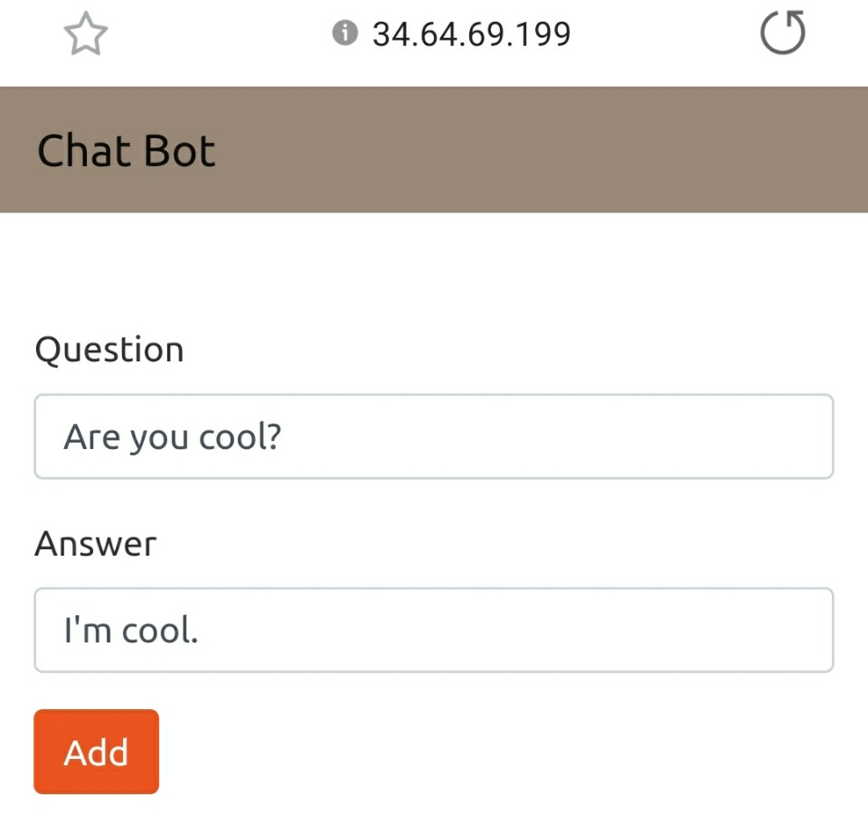

# Django Chatbot hosted at GKE
 Simple Chatbot based on Django using ajax and PostgreSQL.  
 It only works with questions that are added manually at the DB.   
 This code is deployed on GKE, so feel free to check out and add some questions!
   
 Link : <http://34.64.69.199/>
 ==> Sorry, no money to maintain my project. It will close soon.
 
 ## Tech Stack
 * [Django](https://www.djangoproject.com/)  
 * [PostgreSQL](https://www.postgresql.org/)
 * [GKE](https://cloud.google.com/kubernetes-engine?)  
 * [Docker](https://www.docker.com/)  
 * [Django-rest-framework](https://www.django-rest-framework.org/)  
 * Python  
   
 ## Example  
   
 #### Question    
 
   
   
 #### Adding Quesiton
 
 
